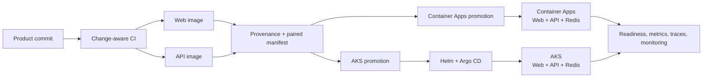

# DevOps Overview

Halligalli separates application delivery from deployment-target ownership. The
Product repository builds one verified Web/API release pair; the public
[Infrastructure repository](https://github.com/optiplex331/Halligalli-infrastructure)
promotes that pair independently to Container Apps or AKS.

## Design at a glance

| Concern | Design | Evidence |
| --- | --- | --- |
| Repository separation | Product owns source, tests, Release Tags, images and provenance. Infrastructure owns Terraform, desired state, promotion, deployment and rollback. | [Product structure](README.md#project-shape), [Infrastructure repository](https://github.com/optiplex331/Halligalli-infrastructure) |
| Change-aware CI | Stable required checks route product, delivery-control and documentation changes to the smallest valid test/build path. Pull requests never publish images. | [CI workflow](.github/workflows/ci.yml), [change filters](.github/utils/change-filters.yaml) |
| Paired supply chain | One Release Tag builds and scans non-root Web/API images from one commit, records per-image GitHub provenance and publishes a manifest binding both immutable digests. | [container workflow](.github/workflows/container.yml), [manifest builder](.github/utils/paired_release_manifest.py) |
| Independent delivery | Container Apps and AKS consume the same paired release through separate target-scoped promotion lanes; one promotion cannot change both targets. | [Infrastructure repository](https://github.com/optiplex331/Halligalli-infrastructure) |
| Observability | The API exposes internal readiness and Prometheus metrics, emits redacted structured telemetry and OTLP traces, and local Compose connects OpenTelemetry Collector to Tempo. | [API surfaces](apps/api/src/halligalli_api/app.py), [telemetry](apps/api/src/halligalli_api/observability.py), [local stack](compose.yaml) |
| Protected rollback | Desired state is digest-pinned and Web/API rollback is always paired. Container Apps uses an explicit local operator deployment after PR review; AKS retains its target-owned GitOps path. | [Infrastructure repository](https://github.com/optiplex331/Halligalli-infrastructure) |

## Delivery controls

- `Product checks` and `Container build and scan` remain stable branch-protection
  checks while their internal work is selected by changed paths.
- Development images are diagnostic only. Formal promotion accepts Release Tag
  image pairs with matching provenance and a valid paired manifest.
- The Product repository has no Infrastructure write credential. Promotion
  workflows propose target-owned desired-state changes for review.
- Container Apps uses candidate revision validation before traffic switching;
  AKS uses digest-pinned Helm values reconciled by Argo CD.
- Container Apps deployment is deliberately not executed by GitHub Actions.
  After PR review, the operator signs in locally with Azure CLI and runs the
  revision-safe deployment script; no Azure credential is stored in GitHub.
- Workflow permissions are read-only unless a focused promotion job needs
  narrowly scoped repository write access.
- Readiness, public monitoring and deployment evidence are separate signals;
  none is treated as a substitute for the others.
