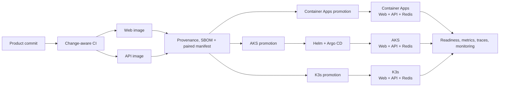

# DevOps Overview

Halligalli separates application delivery from deployment-target ownership. The
Product repository builds one verified Web/API release pair; the public
[Infrastructure repository](https://github.com/optiplex331/Halligalli-infrastructure)
promotes that pair independently to Container Apps, AKS, or K3s.

```mermaid
flowchart LR
    Commit["Product commit"] --> CI["Change-aware CI"]
    CI --> Web["Web image"]
    CI --> API["API image"]
    Web --> Supply["Provenance, SBOM + paired manifest"]
    API --> Supply
    Supply --> CAP["Container Apps promotion"]
    Supply --> AKSP["AKS promotion"]
    Supply --> K3SP["K3s promotion"]
    CAP --> CA["Container Apps<br/>Web + API + Redis"]
    AKSP --> Argo["Helm + Argo CD"]
    K3SP --> K3S["K3s<br/>Web + API + Redis"]
    Argo --> AKS["AKS<br/>Web + API + Redis"]
    CA --> Observe["Readiness, metrics, traces, monitoring"]
    AKS --> Observe
    K3S --> Observe
```

## Design at a glance

| Concern | Design | Evidence |
| --- | --- | --- |
| Repository separation | Product owns source, tests, Release Tags, images and provenance. Infrastructure owns Terraform, desired state, promotion, deployment and rollback. | [Product structure](README.md#project-shape), [Infrastructure repository](https://github.com/optiplex331/Halligalli-infrastructure) |
| Change-aware CI | Pull request CI routes Web, API, container and delivery-control changes to parallel jobs; one `ci-ok` aggregate is the only required check and treats skipped work as success. Pull requests never publish images. | [CI workflow](.github/workflows/ci.yml) |
| Paired supply chain | One Release Tag builds, scans and smokes non-root Web/API images from one commit, records GitHub provenance and a CycloneDX SBOM attestation for each digest, and publishes a manifest binding both immutable digests. Pull requests run the same build, scan and smoke without publishing. | [release workflow](.github/workflows/release.yml), [image workflow](.github/workflows/build-images.yml), [manifest builder](.github/utils/paired_release_manifest.py) |
| Independent delivery | Container Apps, AKS, and K3s consume the same paired release through separate target-scoped promotion lanes; one promotion cannot change multiple targets. | [Infrastructure repository](https://github.com/optiplex331/Halligalli-infrastructure) |
| Observability | The API exposes internal readiness and Prometheus metrics, emits redacted structured telemetry and OTLP traces, and local Compose connects OpenTelemetry Collector to Tempo. | [API surfaces](apps/api/src/halligalli_api/app.py), [telemetry](apps/api/src/halligalli_api/observability.py), [local stack](compose.yaml) |
| Protected rollback | Desired state is digest-pinned and Web/API rollback is always paired. Container Apps uses an explicit local operator deployment after PR review; AKS and K3s retain their target-owned GitOps paths. | [Infrastructure repository](https://github.com/optiplex331/Halligalli-infrastructure) |

## Delivery controls

- `ci-ok` is the only required branch-protection check. It fails when change
  detection fails or any selected work job fails or is cancelled.
- Only Release Tags publish images. Formal promotion accepts Release Tag image
  pairs whose digests carry provenance and SBOM attestations signed by the
  image workflow, plus a valid paired manifest.
- Dependabot minor/patch updates and all GitHub Actions updates auto-merge
  (squash) once `ci-ok` passes; major updates wait for review. Merges made by
  `GITHUB_TOKEN` do not trigger Release Please, which picks them up on the next
  human merge to `master`.
- The Product repository has no Infrastructure write credential. Promotion
  workflows propose target-owned desired-state changes for review.
- Container Apps uses Terraform-owned Single revision readiness followed by an
  immediate read-only public smoke; AKS and K3s use digest-pinned Helm values
  reconciled by Argo CD.
- Container Apps deployment is deliberately not executed by GitHub Actions.
  After PR review, the operator signs in locally with Azure CLI and runs the
  reviewed saved Terraform plan, explicitly approves apply, and immediately
  runs the read-only public smoke; no Azure credential is stored in GitHub.
- Pull request CI is read-only. Only the Release Tag workflow grants package,
  OIDC and attestation write to the image job and release write to the
  manifest job; promotion jobs get narrowly scoped repository write access.
- Readiness, public monitoring and deployment evidence are separate signals;
  none is treated as a substitute for the others.
