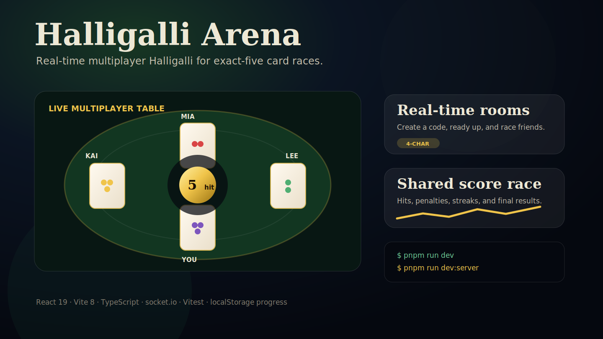

<p align="center">
  
</p>

# Halligalli Arena

Real-time multiplayer Halligalli for midnight card-table races.

Create a room, ready up with friends, flip around a server-authoritative table, and race to spot the exact-five fruit total first. Solo practice is included, but the product story is a fast multiplayer Halligalli arena.

[](https://react.dev/)
[](https://vite.dev/)
[](https://www.typescriptlang.org/)
[](https://socket.io/)
[](LICENSE)

**Live demo**: `https://play.halligalli.games` on Azure Kubernetes Production.



## What It Does

- **Real-time rooms**: create a 3-6 player room with a 4-character code, ready up, and race friends on one shared table.
- **Halligalli race loop**: flip cards, read the visible fruit count, and compete for the exact-five hit.
- **Table-true rules**: clockwise flips, top-card-only counting, exact-five bell windows.
- **Server authority**: multiplayer clients emit intent; the server owns flips, scoring, and match finish.
- **Solo practice**: train reaction speed, accuracy, streaks, and missed-window discipline.
- **Training memory**: local history, trend charts, daily goals, and achievements without accounts.
- **Midnight table polish**: 3D card flips, bell particles, Boss Yang pressure, sound, and reduced-motion fallbacks.

Independent browser project; not affiliated with any commercial card-game publisher.

## Quick Start

```bash
node --version       # v24.x
pnpm --version       # 11.x
pnpm install
pnpm run dev         # Vite dev server on :5173
pnpm run dev:server  # socket.io server on :3001, in a second terminal
```

Open http://localhost:5173.

Single-player works with only `pnpm run dev`. Multiplayer needs `pnpm run dev:server`; Vite proxies `/socket.io` to `http://localhost:3001`, so local browsers should still open the Vite origin at `http://localhost:5173`.

## Commands

```bash
pnpm run test
pnpm run typecheck
pnpm run build
pnpm start          # after pnpm run build
pnpm run simulate:bell
```

Standalone container check:

```bash
docker build --target standalone -t halligalli-arena:standalone .
docker run --rm -p 3001:3001 halligalli-arena:standalone
curl --fail http://localhost:3001/readyz
curl --fail http://localhost:3001/health
```

The standalone image serves the built frontend and socket.io from one Node process. The historical backend-only Docker target has been removed because Container Apps-backed Azure Production is not an active fallback path.

## Rules Model

Cards flip clockwise around the table. Each player has a face-up pile, but only the top card counts. Older cards underneath are invisible to the rule engine.

Ring when one fruit totals exactly five across visible top cards.

Solo and multiplayer both use the supported 3-6 player layouts. The default is 4 players; multiplayer rooms can be created for 3, 4, 5, or 6 players, and the server rejects starting a match while only 2 players are present.

| Event | Points |
|---|---:|
| Correct ring base | +120 |
| Collected cards | +6 per card |
| Speed bonus | difficulty window, up to ~95 / ~75 / ~50 |
| Consecutive streak | +10 per hit in current streak |
| Wrong ring | -50 |
| Penalty cards paid | -4 per card |
| Missed bell window | -30 |

| Mode | Flip speed | Speed-bonus window |
|---|---:|---|
| Easy | ~1.85 s | ~1.9 s |
| Normal | ~1.4 s | ~1.5 s |
| Boss Mode | ~900 ms | ~1.0 s |

## Project Shape

```text
src/
├── App.tsx                 # UI shell and single-player game loop
├── audio/useAudioEngine.ts # Web Audio hook
├── game/                   # shared browser + server game logic
└── multiplayer/            # socket protocol and client projection

server/
├── GameEngine.ts           # multiplayer authority
├── Room.ts                 # lobby and player model
├── health.ts
└── index.ts                # HTTP server + socket.io router

docs/operations/            # release, Azure, and rollback docs
```

## Design Boundaries

- React 19 + Vite 8 + TypeScript + plain CSS.
- Node.js 24 + socket.io 4.
- Browser progress stays in `localStorage`.
- Local multiplayer development uses same-origin socket.io through the Vite `/socket.io` proxy; `VITE_HALLIGALLI_BACKEND_URL` is only for deliberate split-origin runs.
- No account system, database, router, state library, or CSS framework.
- Stable visible copy stays bilingual in Chinese and English.
- New animations must respect `prefers-reduced-motion`.

## Privacy And Safety

Halligalli Arena stores training progress locally in the browser. It does not require accounts, payment data, or a server-side player profile.

Multiplayer rooms are transient in-memory socket.io rooms. The server owns scoring and match results so clients cannot submit authoritative wins.

See [SECURITY.md](SECURITY.md) for reporting and safety boundaries.

## Deployment

Azure Kubernetes Production is the active production story after the June 19, 2026 AKS cutover. It uses the standalone Halligalli runtime, infrastructure-owned Helm Chart and Azure Kubernetes Desired State, Argo CD, and same-origin traffic at `play.halligalli.games`.

Container Apps-backed Azure Production is historical after cutover; its Terraform-managed resources were destroyed and it is not an active fallback. Production Kubernetes chart templates, real Azure Kubernetes Desired State, and cloud operations live in the infrastructure repo.

- Release branch: `master`
- Versioning: Release Please creates human-merged release PRs and `vX.Y.Z` tags
- Release image: release tags build, scan, and publish immutable GHCR standalone images
- Azure infrastructure: AKS and GitOps desired state are operated from the infrastructure repo
- Historical Azure Production: docs-only Static Web Apps plus Container Apps record
- Kubernetes production render surface: infrastructure-owned chart, values, and Argo CD Application
- Health check: `/health` returns `status`, active `rooms`, `version`, and `commit`
- Readiness check: `/readyz` returns `status: "ready"`

The first Container Apps-backed Azure Production activation has been verified historically. Current production language should use Azure Kubernetes Production; Container Apps reactivation or further infrastructure cleanup requires an explicit future decision and the infrastructure repo runbooks.

Operations docs:

- [Operations](docs/operations/README.md)
- [CI/CD](docs/operations/ci-cd.md)
- [Azure Production History](docs/operations/azure-production.md)
- [Kubernetes](docs/operations/kubernetes.md)
- [Rollback](docs/operations/rollback.md)

## Contributing

Small, focused pull requests are welcome. Start with [CONTRIBUTING.md](CONTRIBUTING.md), then run:

```bash
pnpm run test
pnpm run typecheck
pnpm run build
```

## License

MIT. See [LICENSE](LICENSE).
