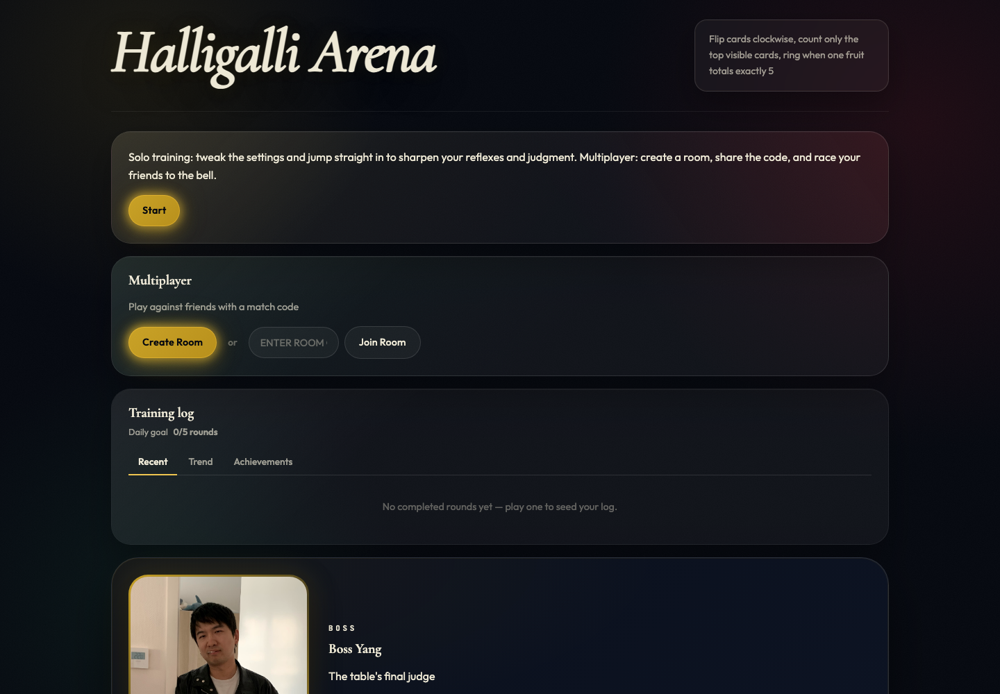

<p align="center">
  
</p>

# Halligalli Arena

Exact-five bell training for a midnight card table.

Watch the visible top cards, spot the fruit total of five, and ring before the window closes. Practice alone, or open a real-time room and race friends on a server-authoritative table.

[](https://react.dev/)
[](https://vite.dev/)
[](https://www.typescriptlang.org/)
[](https://socket.io/)
[](LICENSE)

**Live demo**: `https://play.halligalli.games` after external Azure/HCP Terraform/Name.com activation.




## What It Does

- **Solo practice**: train reaction speed, accuracy, streaks, and missed-window discipline.
- **Real-time rooms**: create a 4-character room code, ready up, and race friends.
- **Table-true rules**: clockwise flips, top-card-only counting, exact-five bell windows.
- **Server authority**: multiplayer clients emit intent; the server owns flips, scoring, and match finish.
- **Training memory**: local history, trend charts, daily goals, and achievements without accounts.
- **Midnight table polish**: 3D card flips, bell particles, Boss Yang pressure, sound, and reduced-motion fallbacks.

Independent browser project; not affiliated with any commercial card-game publisher.

## Quick Start

```bash
node --version       # v24.x
pnpm install
pnpm run dev         # Vite dev server on :5173
pnpm run dev:server  # socket.io server on :3001, in a second terminal
```

Open http://localhost:5173.

Single-player works with only `pnpm run dev`. Multiplayer needs `pnpm run dev:server`.

## Commands

```bash
pnpm run test
pnpm run typecheck
pnpm run build
pnpm start
```

Container checks:

```bash
docker build -t halligalli-arena:local .
docker run --rm -p 3001:3001 halligalli-arena:local
curl --fail http://localhost:3001/readyz
```

For a local all-in-one image that serves the built frontend and socket.io from one Node process:

```bash
docker build --target standalone -t halligalli-arena:standalone .
docker run --rm -p 3001:3001 halligalli-arena:standalone
```

## Rules Model

Cards flip clockwise around the table. Each player has a face-up pile, but only the top card counts. Older cards underneath are invisible to the rule engine.

Ring when one fruit totals exactly five across visible top cards.

| Event | Points |
|---|---:|
| Correct ring base | +120 |
| Collected cards | +6 per card |
| Speed bonus | up to +~50 |
| Consecutive streak | +10 per hit in current streak |
| Wrong ring | -50 |
| Penalty cards paid | -4 per card |
| Missed bell window | -30 |

| Mode | Flip speed | Speed-bonus window |
|---|---:|---|
| Easy | ~1.85 s | generous |
| Normal | ~1.4 s | standard |
| Boss | ~900 ms | tight |

## Project Shape

```text
src/
├── App.tsx                 # UI shell and single-player game loop
├── audio/useAudioEngine.ts # Web Audio hook
├── game/                   # shared browser + server game logic
└── multiplayer/            # socket protocol and client projection

server/
├── GameEngine.ts           # multiplayer authority
├── Room.ts                 # lobby and player model
├── health.ts
└── index.ts                # HTTP server + socket.io router

deploy/azure/               # Azure Production Terraform reference
docs/operations/            # release, Azure, and rollback docs
```

## Design Boundaries

- React 19 + Vite 8 + TypeScript + plain CSS.
- Node.js 24 + socket.io 4.
- Browser progress stays in `localStorage`.
- No account system, database, router, state library, or CSS framework.
- Stable visible copy stays bilingual in Chinese and English.
- New animations must respect `prefers-reduced-motion`.

## Privacy And Safety

Halligalli Arena stores training progress locally in the browser. It does not require accounts, payment data, or a server-side player profile.

Multiplayer rooms are transient in-memory socket.io rooms. The server owns scoring and match results so clients cannot submit authoritative wins.

See [SECURITY.md](SECURITY.md) for reporting and safety boundaries.

## Deployment

Azure Production is the visible manual stage for the active Azure Production target without implying production cutover. The public Terraform reference models an Azure Static Web Apps frontend and Azure Container Apps backend with example values; real account-specific tfvars, backend config, state, Azure credentials, deployment tokens, and domain bindings are intentionally excluded from Git.

- Release branch: `master`
- Versioning: Release Please creates human-merged release PRs and `vX.Y.Z` tags
- Release image: release tags build, scan, and publish immutable GHCR backend images
- Azure infrastructure: `.github/workflows/azure-production-infra.yml`
- Azure deployment: `.github/workflows/azure-production.yml`
- Health check: `/health`
- Readiness check: `/readyz`

Operations docs:

- [CI/CD](docs/operations/ci-cd.md)
- [Azure Production](docs/operations/azure-production.md)
- [Rollback](docs/operations/rollback.md)

## Contributing

Small, focused pull requests are welcome. Start with [CONTRIBUTING.md](CONTRIBUTING.md), then run:

```bash
pnpm run test
pnpm run typecheck
pnpm run build
```

## License

MIT. See [LICENSE](LICENSE).
